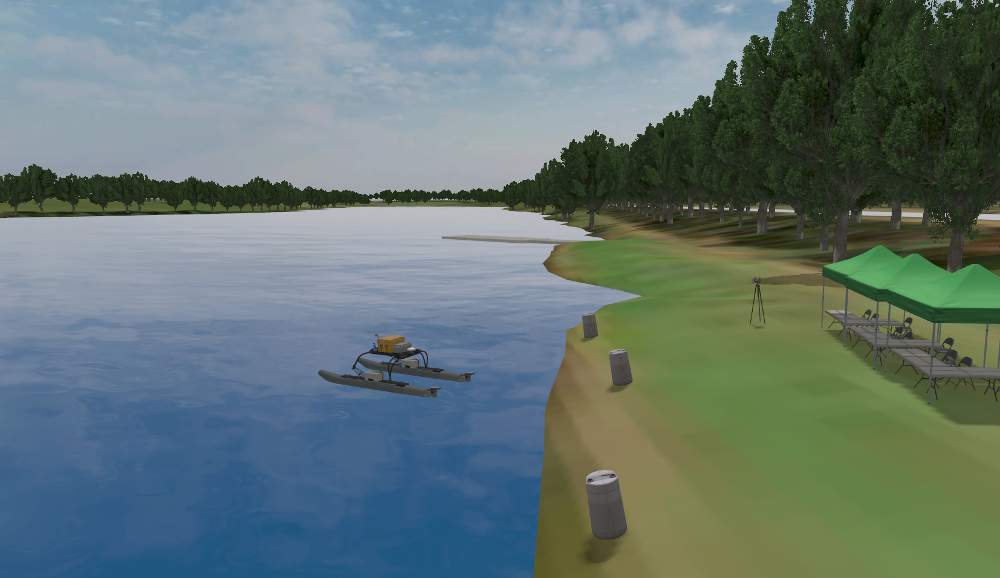

# Virtual RobotX (VRX)
This repository is the home to the source code and software documentation for the VRX simulation environment, which supports simulation of unmanned surface vehicles in marine environments.
* Designed in coordination with RobotX organizers, this project provides arenas and tasks similar to those featured in past and future RobotX competitions, as well as a description of the WAM-V platform.
* For RobotX competitors this simulation environment is intended as a first step toward developing tools prototyping solutions in advance of physical on-water testing.
* We also welcome users with simulation needs beyond RobotX. As we continue to improve the environment, we hope to offer support to a wide range of potential applications.

## A new modernization development: Gazebo Harmonic and ROS 2 Jazzy

> [!NOTE]
> This developement effort was executed by the
> [Honu Robotics](https://.honurobotics.com) team, thanks to the sponsorship
> of [RoboNation](https://robonation.org/).

We are happy to announce that the repository has been ported to use supported
versions of Gazebo and ROS 2:
  * Code is now working with Gazebo Harmonic and ROS 2 Jazzy
  * This is the recommended configuration for new users.
  * Users who wish to continue running Gazebo Garden and ROS 2 Humble can still do so using the `humble` branch of this repository.

## The VRX Competition
The VRX environment is also the "virtual venue" for the [VRX Competition](https://github.com/osrf/vrx/wiki). Please see our Wiki for tutorials and links to registration and documentation relevant to the virtual competition.

[](https://vimeo.com/851696025 "Gazebo Virtual RobotX v. 2.3 - Click to Watch!")


## Getting Started

 * Watch the [Release 2.3 Highlight Video](https://vimeo.com/851696025).
 * The [VRX Wiki](https://github.com/osrf/vrx/wiki) provides documentation and tutorials.
 * The instructions assume a basic familiarity with the ROS environment and Gazebo.  If these tools are new to you, we recommend starting with the excellent [ROS Tutorials](http://wiki.ros.org/ROS/Tutorials)
 * For technical problems, please use the [project issue tracker](https://github.com/osrf/vrx/issues) to describe your problem or request support.

## Reference

If you use the VRX simulation in your work, please cite our summary publication, [Toward Maritime Robotic Simulation in Gazebo](https://wiki.nps.edu/display/BB/Publications?preview=/1173263776/1173263778/PID6131719.pdf):

```
@InProceedings{bingham19toward,
  Title                    = {Toward Maritime Robotic Simulation in Gazebo},
  Author                   = {Brian Bingham and Carlos Aguero and Michael McCarrin and Joseph Klamo and Joshua Malia and Kevin Allen and Tyler Lum and Marshall Rawson and Rumman Waqar},
  Booktitle                = {Proceedings of MTS/IEEE OCEANS Conference},
  Year                     = {2019},
  Address                  = {Seattle, WA},
  Month                    = {October}
}
```

## Contributing
This project is under active development to support the VRX and RobotX teams. We are adding and improving things all the time. Our primary focus is to provide the fundamental aspects of the robot and environment, but we rely on the community to develop additional functionality around their particular use cases.

If you have any questions about these topics, or would like to work on other aspects, please contribute.  You can contact us directly (see below), submit an [issue](https://github.com/osrf/vrx/issues) or, better yet, submit a [pull request](https://github.com/osrf/vrx/pulls/)!

## Contributors

> [!NOTE]
> The [Honu Robotics](https://.honurobotics.com) team, thanks to the
> sponsorship of [RoboNation](https://robonation.org/) is currently the
> maintainer of this repository.

We continue to receive important improvements from the community.  We have done our best to document this on our [Contributors Wiki](https://github.com/osrf/vrx/wiki/Contributors).

## Contacts

 * Carlos Agüero <caguero@honurobotics.com>
 * Brian Bingham <bbingham@honurobotics.com>
 * Michael McCarrin <mrmccarr@nps.edu>
